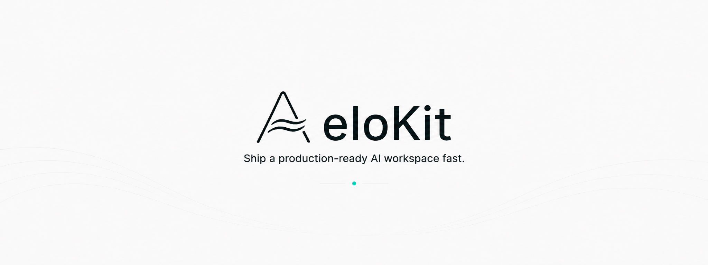

# AeloKit

AeloKit is an AI-native SaaS engineering foundation for building production-ready AI workspaces, agent-enabled SaaS products, and self-hostable AI platforms.

It is not just a chatbot starter. AeloKit combines a production SaaS base with the first layers of an AI workspace: auth, billing, credits, content, storage, app surfaces, AI contracts, streaming chat, persistence, memory, knowledge, retrieval metadata, and usage audit foundations.

## What is AeloKit?

AeloKit is a pnpm + Turborepo workspace centered on a Next.js App Router application in `apps/web` and reusable domain packages in `packages/*`.

The current product direction is defined by `docs/product/AELOKIT_AI_SAAS_PLATFORM_PRD.md`: build an AI-native SaaS engineering foundation that can support production AI workspaces, agent-enabled products, and future self-hostable platform layers.

## Why AeloKit?

- Ship from a real SaaS base instead of wiring auth, dashboard, billing, credits, email, storage, analytics, docs, environment validation, and deployment conventions from scratch.
- Keep AI UI, runtime wiring, contracts, persistence, DB schema, provider secrets, and credits ownership in clear modules.
- Start with an AI workspace loop that can stream responses, persist conversation state, show citations/tool status foundations, and audit usage before expanding into heavier agent platform capabilities.

## Current Capabilities

- Next.js App Router web app in `apps/web`.
- SaaS marketing, docs, dashboard, settings, admin, pricing, auth, payment, knowledge, and chat surfaces inside `apps/web`.
- Better Auth integration.
- Drizzle + PostgreSQL database package in `@repo/db`.
- Stripe / Creem-ready payment package in `@repo/payment`.
- Credits package and ledger primitives in `@repo/credits`.
- Env validation through `@repo/env`.
- Fumadocs content pipeline.
- Storage, mail, newsletter, notification, analytics, i18n, config, and shared utility packages.
- App-local UI components in `apps/web/src/components`, including shadcn/ui-style primitives.

## AI Platform Capabilities

### Implemented Foundation

- AI contracts package `@repo/ai` for providers, models, agents, tools, skills, memory, knowledge, MCP, usage, permissions, errors, AI SDK adapters, Mastra adapters, and runtime types.
- Assistant UI based chat workspace components in `apps/web/src/components/ai`.
- Vercel AI SDK streaming route at `POST /api/ai/chat`.
- OpenAI provider wiring in the web app AI runtime layer.
- AI thread, message, message part, tool call, and usage audit persistence in the database layer.
- Tool call persistence foundation.
- Mastra memory integration.
- Manual knowledge source ingestion.
- Embedding, vector retrieval, and citation metadata foundation.
- AI usage audit, cost event, and credits billing foundation.
- Admin usage audit surface.
- Server-side AI provider and embedding secret handling through env validation.

### In Progress / Future Direction

These are product directions from the PRD, not claims of complete support in the current codebase:

- Full agent runtime.
- Full MCP platform.
- Public gateway.
- Worker for background AI jobs, embedding, indexing, summaries, retries, and long-running runs.
- Studio for agent, skill, workflow, prompt, tool, and eval configuration.
- Observability platform for logs, traces, evals, cost dashboards, model performance, and workflow inspection.
- Full BYOK.
- Multi-tenant enterprise org/workspace support.
- Full eval system.
- Shared design system package after app-local AI presentation components become stable and dependency-clean.

## Tech Stack

- Turborepo + pnpm workspace
- Next.js App Router + React + TypeScript
- Tailwind CSS + shadcn/ui-style primitives
- PostgreSQL + Drizzle ORM
- Better Auth
- Vercel AI SDK
- assistant-ui
- Mastra
- Stripe / Creem-ready payment package
- Resend-ready mail and newsletter flows
- S3-compatible object storage
- Fumadocs MDX content
- Biome for linting and formatting

## Quick Start

```bash
pnpm install
cp env.example .env
pnpm dev
```

Open the web app from the local URL printed by Next.js.

## Environment Variables

`env.example` is the single complete environment reference for this repository. Copy it to `.env` for local development and fill in real values for the providers you enable.

Do not commit secrets. Application code should read business environment variables through `@repo/env/server` or `@repo/env/client`, not ad hoc `process.env` access.

Useful validation command:

```bash
pnpm check:env
```

## Local Development

```bash
# Monorepo
pnpm dev
pnpm build
pnpm lint
pnpm typecheck

# Web app
pnpm --filter @repo/web dev
pnpm --filter @repo/web build
pnpm --filter @repo/web content
pnpm --filter @repo/web lint
pnpm --filter @repo/web typecheck

# Database package
pnpm --filter @repo/db db:generate
pnpm --filter @repo/db db:migrate
pnpm --filter @repo/db db:studio
```

Do not run database migrations against a shared database until the target environment and credentials are explicit.

## Workspace Structure

```text
apps/
  web/

packages/
  ai/
  analytics/
  auth/
  config/
  credits/
  db/
  env/
  i18n/
  mail/
  newsletter/
  notification/
  payment/
  shared/
  storage/
```

The current UI lives in `apps/web/src/components/`. There is intentionally no `packages/ui` or `packages/design-system` yet.

## Important Boundaries

- `apps/web` is the current complete SaaS app. Do not split future apps until a user-confirmed task opens that scope.
- `packages/*` own reusable domain logic and must not import app code.
- Drizzle schema and real migrations are owned by `packages/db/src`.
- `apps/web/src/db/*` is compatibility shim territory.
- `@repo/ai` owns contracts, types, adapters, and runtime type definitions; it does not own route handlers, React UI, DB queries, schema, migrations, provider SDK initialization, or live runtime execution.
- `apps/web/src/ai` owns web app AI runtime wiring.
- The AI chat route is `POST /api/ai/chat`; do not create a generic `/api/chat` route.
- Provider and embedding secrets must stay server-side.
- AI usage audit is separate from credits ledger mutation.

## Validation Commands

```bash
pnpm check:env
pnpm check:package-exports
pnpm check:db-shims
pnpm --filter @repo/web typecheck
pnpm --filter @repo/web lint
pnpm --filter @repo/db typecheck
pnpm --filter @repo/ai typecheck
```

Run only the checks relevant to the change unless a task explicitly asks for full validation.

## Deployment

The recommended managed deployment target is Vercel with `apps/web` as the root directory.

- Root Directory: `apps/web`
- Install Command: `pnpm install --frozen-lockfile`
- Build Command: `pnpm build`
- Output: Next.js default

Docker builds run from the monorepo root:

```bash
docker build -t aelokit .
```

Set production secrets in your deployment provider, not in the repository.

## Documentation

The product north star lives in:

- `docs/product/AELOKIT_AI_SAAS_PLATFORM_PRD.md`

Engineering rules live in:

- `AGENTS.md`
- `CLAUDE.md`

## License

This repository currently uses the MIT License. Review [LICENSE](LICENSE) before distributing a commercial product or hosted derivative, and replace this section with your final product licensing terms if your distribution model changes.
